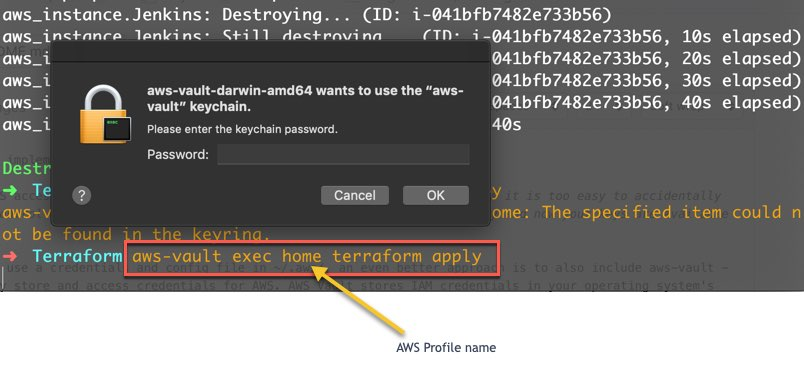
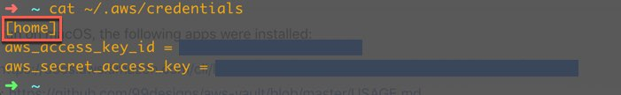

# securing-terraform
securing your terraform implementation using aws-vault

You should NEVER put AWS access key or secret key into any *.tf or terraform.tfvars files as it is too easy to accidentally upload them to source control such as github, if your .gitignore file is not setup correctly and now your keys are available for all to see. 

A better approach is to use a credentials and config file in ~/.aws/, an even better approach is to also include aws-vault - Allowing you to securely store and access credentials for AWS. AWS Vault stores IAM credentials in your operating system's secure keystore and then generates temporary credentials from those to expose to your shell and applications. It's designed to be complementary to the aws cli tools, and is aware of your profiles and configuration in ~/.aws/config.

meaning when you run the terraform command (plan, apply and destroy) you also have to provide a keystore password: 

   
   
   
   


## Environment requirements 
This was configured and run on macOS, the following apps were installed: 

* _AWS-CLI installed: https://docs.aws.amazon.com/cli/latest/userguide/cli-install-macos.html
* _AWS-Vault installed: https://github.com/99designs/aws-vault/blob/master/USAGE.md

```groovy 
brew cask install aws-vault
```

## Key Terraform Files
As most of the libraries use similar logic, a number of their input variables are the same. The below list gives an overview and description of these variables.

* _providers.tf_: specify aws provider 
* _variables.tf_: Variables file 
* _terraform.tfvars_: assigning variables 
